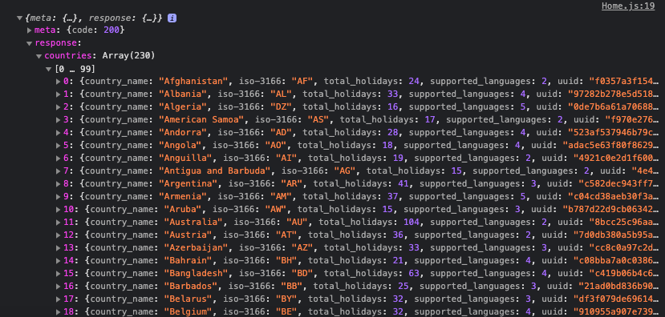

###  General Assembly, Software Engineering Immersive

# Everyday Holiday 


# Project-2: 48-hour Reacathon

## Overview

My second project with General Assembly was a 48-hour 'hackathon' to build a multiple-page website using React which consumes a public API. This was a pair programming task.

My partner, [Guy Kozlovskij ](https://github.com/guykozlovskij) and I decided to built a mobile-friendly app that displays all local holidays for all countries.


## Deployment

- Please follow the [link](https://dimitartsonev-project2.netlify.app/) to visit the App deployed with Netlify.

- [Repository link](https://github.com/D-Tsonev/SEI-Project-2)

## The Brief

Build a React application that consumes a public API during a 48-hour hackathon between two people.

- 48 hours to build a React application that consumes a public API.
- Have several components, including at least one classical and one functional.
- The app can have a router with several "pages", which was up to our discretion if it made sense for our project.
- Include wireframes that we designed before building the app.
- Be deployed online and accessible to the public.
- A git repository hosted on Github, with a link to our hosted project and frequent commits dating back to the very beginning of the project.
- Sick with KISS (Keep It Simple Stupid) and DRY (Don't Repeat Yourself) principles

## Technologies Used

- **API**:
  * [Calendarific API](https://calendarific.com/)
- **Frontend**:
  * JavaScript (ES6)
  * React.js
  * HTML5
  * CSS3
  * Axios (for API requests)
  * React-router-dom

- **Development Tools**:
  * VS Code (Live Share)
  * Git + GitHub
  * Live Share
  * Netlify

## Installation Instructions

1. Clone repo code from GitHub onto your machine.
2. Use `yarn` or `npm` to install all dependencies from the `package.json` file.
3. Start server: <code>yarn start</code>/<code>npm start</code>

## General Approach & Planning

We first had to choose an API we wanted to use. My partner and I realised we both have a passion for travelling and we love to explore different cultures, so we decided to use the [Calendarific API](https://calendarific.com/).


We spent a short time planning and once we had a clear idea we jumped straight into coding. 
Our first task was to ensure that we could get the countries names to appear on our page.

We created а function using Axios to fetch data from the API:

```js
export function getAllCountries(){
  return axios.get('https://calendarific.com/api/v2/countries?api_key=aad5de35593f48602bc3a0b1908fe764e122af32')
}
```

We built all the needs for the landing page and made all the logic with the useEffect and useState.


```js
function Home() {
  const [countries, setCountries] = React.useState(null)
  const [setIsError] = React.useState(false)

  //* Gets a list of all countries and stores them in setCountries variable
  React.useEffect(() => {
    const getData = async () => {
      try {
        const response = await getAllCountries()
        setCountries(response.data)
      } catch (error) {
        setIsError(true)
      }
    }
    getData()
  }, [setIsError])

```

We managed to see the data in the console.log using the our <code>getAllCountries</code> function. 




After that, we had to create select handlers for the country name and year of the user's choice.

```js 

const [selectedCountry, setSelecteCountry] = React.useState('')
const [selectedYear, setSelectedYear] = React.useState('')

  const handleSelect = (e) => {
    setSelecteCountry(e.target.value)
  }

  const handleSelectedYear = (e) => {
    setSelectedYear(e.target.value)
  }

```

After implementing these in the JSX we then had a visual idea of how our application would look.
We then had to ensure that the user will have an option to select country and year and we will store that information.

```js 
 <select onChange={handleSelect} value={selectedCountry}>
            <option value="" disabled selected>
              Select Country
            </option>

            {countries ? (
              countries.response.countries.map((country) => (
                <option key={country.country_name} value={country['iso-3166']}>
                  {country.country_name}
                </option>
              ))
            ) : (
              <option value="" disabled selected>
                ...Loading
              </option>
            )}
          </select>

          <select onChange={handleSelectedYear} value={selectedYear}>
            <option value="" disabled selected>
              Select Year
            </option>

```


After that we created another path to a Holiday display page in <code>App.js</code> using <code >BrowserRouter</code> and the link for it we were planning to wrap in a "GO" buttton.

```js 

function App() {
  return (
    <Router>
      <Switch>
        <Route exact path="/" component={Home} />
        <Route path="/holidays/:id/:year" component={HolidayDisplay} />
      </Switch>
    </Router>
  )
}
```

There was one last thing we needed on our Home page and that was the "GO" button which was hidden from the user.
To do this we used a ternary to show nothing if no year and country had been selected and to show "GO" once both had been selected.

 ```js
          {selectedYear && selectedCountry ? ( 
            <Link to={`/holidays/${selectedCountry}/${selectedYear}`}>
              <button>GO!</button>
            </Link>
          ) : (
            <strong></strong>
          )}
```


Finally, we started working on showing holidays page using a function <code>getSingleCountry</code> we created in <code> api.js </code> which takes country <code>id</code> and <code>year</code> as arguments.

```js 
export function getSingleCountry(id, year) {
  return axios.get(`${holidayUrl}&country=${id}&year=${year}`)
}
```

In HolidayDisplay.js file we used <code>useParams</code> to get the country <code>id</code> and <code>year</code> and passed it to <code>getSingleCountry</code> functon.

```js 

function HolidayDisplay() {
  const { id, year } = useParams()
  const history = useHistory()
  const [singleCountry, setSingleCountry] = React.useState(null)

  React.useEffect(() => {
    const getData = async () => {
      const response = await getSingleCountry(id, year)
      setSingleCountry(response.data)
    }
    getData()
  }, [id, year])

```

Once the data was retrieved, it was relatively easy to <code>map</code> into array of <code>singleCountry.response.holidays</code> and create the Holiday Card.

```js 

<section className="HolidayCard">
        <button onClick={handleBack}>Back</button>
        {singleCountry ?
          (<button onClick={handleBack}>Back</button>) && (
            singleCountry.response.holidays.map((holiday) => (
              <div className="holiday-view" key={holiday.name}>
                <h3>{holiday.name}</h3> 
                <h5>{holiday.date.datetime.day}/{holiday.date.datetime.month}/{holiday.date.datetime.year}</h5>
                <h4>{holiday.description}</h4>
              </div>
            ))) 
          : 
          (<p>... Loading holidays </p>)}
      </section>

```
Once these were finalised we spent our last half day styling the app and ensuring that our app was responsive to various screen sizes.

  

## Challenges

The most difficult part of our project was the logic behind the url request expected for the Holiday Card.
<code>'https://calendarific.com/api/v2/holidays?&api_key=baa9dc110aa712sd3a9fa2a3dwb6c01d4c875950dc32vs&country=UK&year=2021'</code>                    
The request needs to contain country code stored under value: iso-3166  and that was the trickiest part.
We had to create two different functions: one for the Home page, displaying a list of all countries, and another using the country code and year to display the Holiday card.


## Key Learning
This was my first pair project, and overall the dynamic worked well producing an application we were proud of.
I learnt a lot about collaborating, communicating, planning,using Live Share to work on the same code in real-time. This worked well enough for this short project, but I probably would not use this for a bigger project when it would be more useful to divide and conquer.
One aspect that I would improve for the next group or pair project is the delegation of different tasks. In my opinion, we spent too much time screen-sharing on the same tasks when these could have easily been delegated, allowing us more time to add more features to our finished application.

## Future Features

To create a better user experience, I will implement a filter function that will display holidays filtered by national, local, religious and observance.


